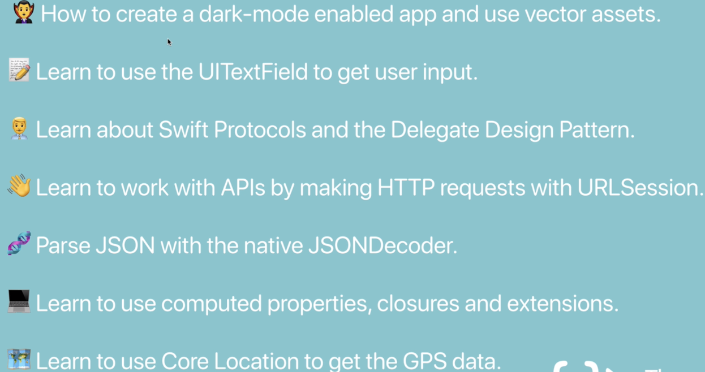

# Clima-Section-13

## Section content can be seen below:

## Key concepts shown in this section are:

143 - Dark mode, vector assets, SF Symbols
144 - UITextFieldDelegate, textFieldShouldReturn, textFieldShouldEndEditing, textFieldDidEndEditing
145 - Protocols
147 - Protocols, Delegates
149 - URLSession
150 - Closures
151 - JSON Decoding
152 - Computed property, stored properties, switch-case, range operator
153 - Encodable protocol, codable, delegate and protocol example
155 - Method naming conventions external/internal name, delegate’s source object as the first argument
156 - DispatchQueue, Completion Handler
157 - Extensions allow us to add extra functionality to our existing classes, structures, or other data types just like protocols
158 - Extensions using protocols, //MARK concept, code organizing
159 - RequestLocation , startUpdatingLocation, Core Location, CLLocationManager, didUpdateLocations

