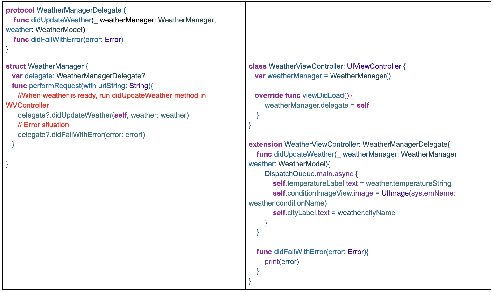

# Clima-Section-13

## Section content can be seen below:

## Key concepts shown in this section are:

143 - Dark mode, vector assets, SF Symbols 
144 - UITextFieldDelegate, textFieldShouldReturn, textFieldShouldEndEditing, textFieldDidEndEditing 
145 - Protocols 
147 - Protocols, Delegates 
149 - URLSession 
150 - Closures 
151 - JSON Decoding 
152 - Computed property, stored properties, switch-case, range operator 
153 - Encodable protocol, codable, delegate and protocol example 
155 - Method naming conventions external/internal name, delegate’s source object as the first argument 
156 - DispatchQueue, Completion Handler 
157 - Extensions allow us to add extra functionality to our existing classes, structures, or other data types just like protocols 
158 - Extensions using protocols, //MARK concept, code organizing 
159 - RequestLocation , startUpdatingLocation, Core Location CLLocationManager, didUpdateLocations 

## Scheme of Delegate Design Pattern:

- The delegation design pattern is a behavioral pattern in Swift that allows one object to act on behalf of another object. In Swift, this is often achieved through the use of protocols and delegate properties. 

- It allows an object (WeatherManager) to notify another object (WeatherViewController) about certain events or data changes without tightly coupling the two classes. The delegate methods are implemented in the delegate class to define the behavior when these events occur
